Kicad StepUp starter Guide
==========================
:Author:    Maurice
:Email:     https://launchpad.net/~easyw
:Author Initials: MEW
:Date:      13 Feb 2016
:Revision:  2.0.1
:website: http://sourceforge.net/projects/kicadstepup/
:docname: kicadStepUp-starter-Guide.adoc

<<<

Basic Info
----------

*kicad StepUp 3D mechanical exporter* for collaborative exchange between KiCad and FreeCAD/MCAD;
With *kicad StepUp*, it is possible to work in kicad EDA with the same component model data
available in the *STEP AP214 3D format*, and obtain a 3D STEP AP214 model of the pcb board and
a complete board assemblies with electronic modules, to be used for *MCAD interchange*.
The accurate 3D visualization of components on board assemblies in kicad 3dviewer, is
maintained in the same accuracy and aspect in STEP AP214 format. +
The *kicad StepUp* maintains the usual way to work with kicad, but improves the process
to work in a collaborative way with mechanical designers bringing near ECAD and MCAD environments. +

*New!!!* now kicad StepUp comes in 3 flavours: +
1. running as a *script* +
2. running as a *GUI* +
3. running as a *Mod* native FreeCAD *WorkBench* +

link:http://sourceforge.net/projects/kicadstepup/[kicadStepUp at sourceforge] +
link:https://youtu.be/h6wMU3lE_sA[YouTube Kicad StepUp New Tutorial video] +
link:http://youtu.be/Ukd47VXYzQU[YouTube Kicad StepUp old script video] +

requirements
------------
link:http://kicad-pcb.org/[KiCad EDA] version 4.00 or later +
link:http://freecadweb.org/[FreeCAD] version 0.15 or later (use only STABLE versions)

<<< 

OverView
--------
.
**********************************************************************
to run the demo:

in Linux:
change dir to the folder in which you have extracted the demo +
+./launch-kicad_StepUp-Tools-demo.sh+

in windows:
change dir to the folder in which you have extracted the demo +
+launch-kicad_StepUp-Tools-demo.bat+

in OSX:
change dir to the folder in which you have extracted the demo +
+./launch-kicad_StepUp-Tools-OSX-demo.sh+

the demo comes with a kicad project, along with all needed STEP and wrl modules, just to be used just out of the box +
(*NB* use the script from inside the dir) +
to see the kicad board, change dir to the folder in which you have extracted the demo +
*in windows:* +
 +launch-kicad-demo-project.bat+ +
*in linux:* +
 +./launch-kicad-demo-project.sh+ +
 *in OSX:* +
 +./launch-kicad-demo-project-OSX.sh+ +
**********************************************************************

kicad StepUp tools GUI
----------------------

.kicad StepUp tools GUI Overview
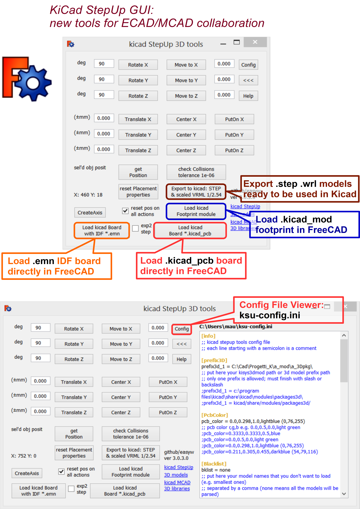

<<<

Introduction
------------
kicad StepUp is a 3D mechanical exporter for kicad board and assemblies +
It will improve a collaborative exchange between KiCad and FreeCAD/MCAD +
With *kicad StepUp* script, it is possible to work in kicad EDA with the same component model data
available in the *STEP AP214 3D format*, and obtain a 3D STEP AP214 model of the pcb board and
a complete board assemblies with electronic modules, to be used for *MCAD interchange*. +
The accurate 3D visualization of components on board assemblies in kicad 3dviewer, can then be
maintained in the same accuracy and aspect in STEP AP214 format, just generating VRML models
from STEP or FreeCAD mechanical models and exporting the board through kicad StepUp script. +
The *kicad StepUp* script maintains the usual way to work with kicad, but improves the process
to work in a collaborative way with mechanical designers bringing near ECAD and MCAD environments. +

Kicad StepUp allows the user to modeling the 3D modules starting from FreeCAD
(instead of using Wings3D), creating models in STEP AP214 and rendering the
pcb board and components in native STEP AP214. +
*Note:* *kicad StepUp* 3D MCAD exporter is compatible with: +
      *STEP* with colors files (_.step_, _.stp_ extensions) +
      *IGES* with colors files (_.iges_, _.igs_ extensions) +

Designing in kicad native 3d-viewer will produce a fully aligned STEP version
with the same view of kicad 3d render. +
Now the two words have the same accurate 3D visualization; it is possible to design in kicad EDA and transfer the artwork to MCAD (FreeCAD) smoothly

*WYSIWYG from EDA to MCAD*

<<<

WYSIWYG from EDA to MCAD
------------------------

.kicad StepUp in Kicad 3d-viewer
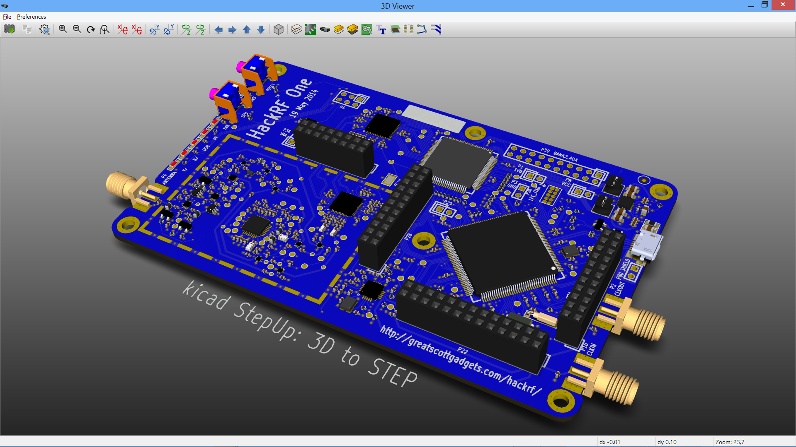

.kicad StepUp in MCAD Catia
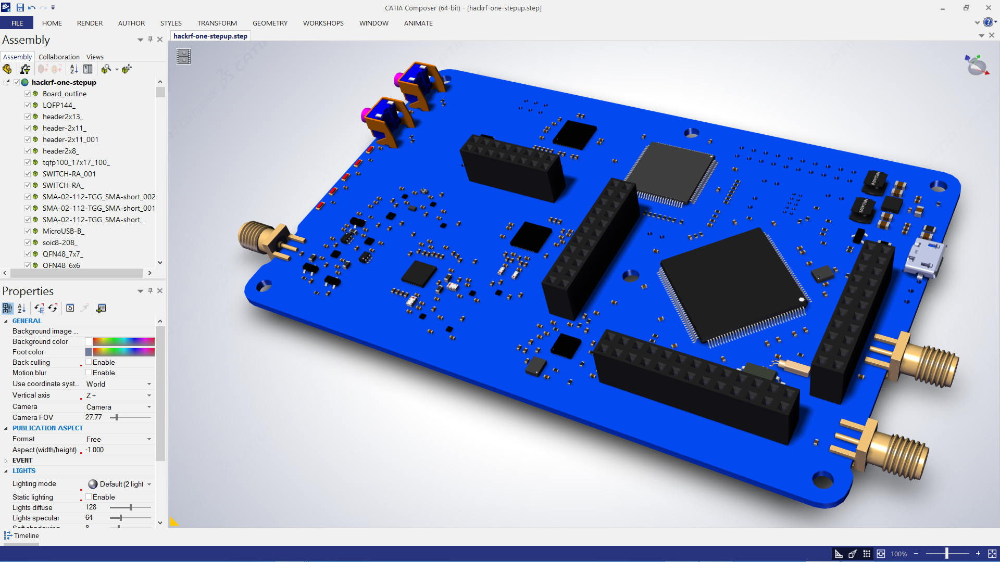

Basic How To '(using kicad StepUp the easiest way)'
---------------------------------------------------

*(not changing the way you use kicad)*

*1.* just copy the STEP 3d models in the same folder in which there are your wrl 3d models and
   use the same name of the wrl model name (e.g. r_0603.wrl => r_0603.step) +
*2.* open in FreeCAD the Macro kicad-StepUp-tools.FCMacro and
   edit the config file ksu-config.ini (wich is autogenerate at first running of the macro) with e.g. notepad changing your model prefix to your KISYS3DMOD path +
*3.* clik on the button to open your kicad pcbnew board file +
*4.* watch the script assembling your 3D board with 3D models :) +
you can also add the macro button to the FreeCAD toolbar following these instructions: +
 *Note:* link:http://www.freecadweb.org/wiki/index.php?title=Customize_ToolsBar[FreeCAD forum Customize Toolbar] how to add a button to Toolbar in FreeCAD
 adding also the kicad StepUp icon +
*5.* the Macro can be executed as a script
    <path to Freecad executable file>/freecad <path to the Macro file>/kicad-StepUp-tools.FCMacro <name_of_board_without_extension> +
    '(e.g. freecad kicad-StepUp-tools.FCMacro myboard)' +
*just watch the Macro assembling your 3D board with 3D models :)*
*6.* the kicad StepUp can be also a Mod WorkBench for FreeCAD: +
copy the folder kicadStepUpMod in the right folder for your OS +
link:http://www.freecadweb.org/wiki/index.php?title=Installing_more_workbenches[FreeCAD Installing workbenches]

How To '(using kicad StepUp the best way)'
------------------------------------------

*(getting the best from STEP models)*

*1.* just copy the STEP 3d models in the same folder in which there are your wrl 3d models +
*2.* export the STEP models, scaled 1/2.54 to wrl with the same name of the STEP model
(e.g. r_0603.wrl => r_0603.step); in this way your 3D board in kicad pcbnew 3d-viewer and in FreeCAD workbench will look perfectly aligned +
*3.* open in FreeCAD the Macro kicad-StepUp-tools.FCMacro and
   edit the config file ksu-config.ini (wich is autogenerate at first running of the macro) with e.g. notepad changing your model prefix to your KISYS3DMOD path +
*4.* clik on the button to open your kicad pcbnew board file +
*5.* watch the script assembling your 3D board with 3D models :) +
you can also add the macro button to the FreeCAD toolbar following these instructions: +
 *Note:* link:http://www.freecadweb.org/wiki/index.php?title=Customize_ToolsBar[FreeCAD forum Customize Toolbar] how to add a button to Toolbar in FreeCAD
 adding also the kicad StepUp icon +
*6.* the Macro can be executed as a script
    <path to Freecad executable file>/freecad <path to the Macro file>/kicad-StepUp-tools.FCMacro <name_of_board_without_extension> +
    '(e.g. freecad kicad-StepUp-tools.FCMacro myboard)' +
*just watch the Macro assembling your 3D board with 3D models :)*
*7.* the kicad StepUp can be also a Mod WorkBench for FreeCAD: +
copy the folder kicadStepUpMod in the right folder for your OS +
link:http://www.freecadweb.org/wiki/index.php?title=Installing_more_workbenches[FreeCAD Installing workbenches]

<<<
kicad StepUp workflow
---------------------

.kicad StepUp WorkFlow
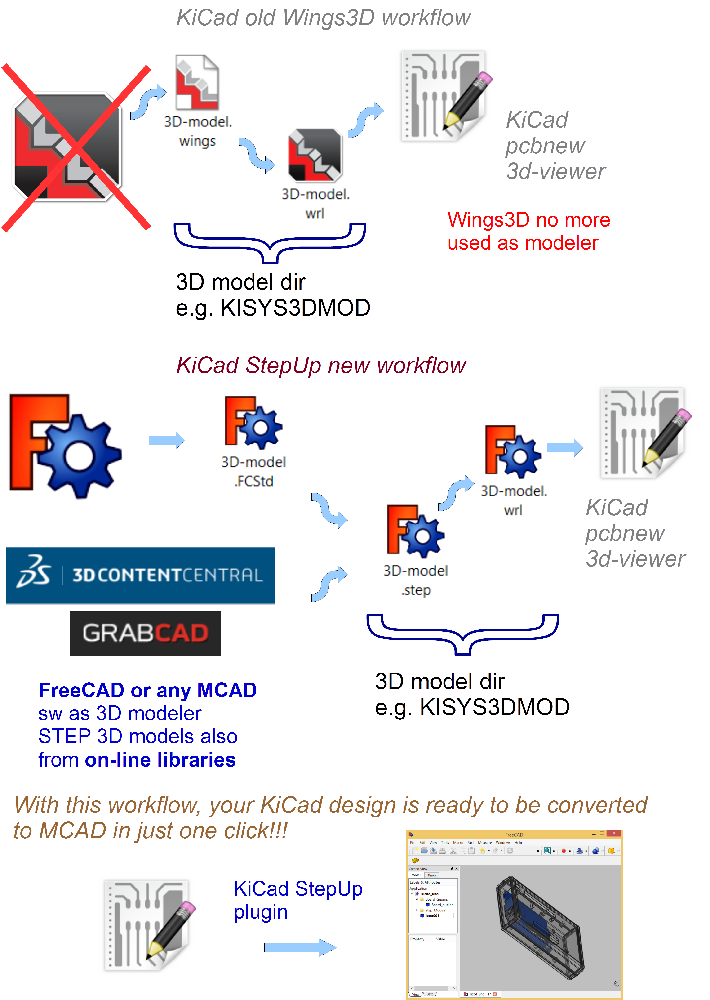

Create your own Library
----------------------

The way to build a STEP models library to be easily used by the script is:

1. start modeling your 3d object in scale 1:1 in mm
(which is the way in which mechanical stuff are used to be) +
2. convert your model to STEP in scale 1:1 +
3. assure that your STEP module *is fused to just one solid object* +
(_Part Boolean Union in FreeCAD_) +
*Note:* here link:http://forum.freecadweb.org/viewtopic.php?t=8451#p69489[FreeCAD forum fusion howto] some tips to fuse correctly objects in FreeCAD +
4. convert the model to wrl in scale 1/2.54 (0.3937001) +
(which is the scale used by kicad 3d-viewer or maintain 1:1 scale in exporting and apply
the scale 1/2.54 to the wrl model in 3d-viewer) +
5. use the same name to wrl and STEP model +
6. put the STEP model and VRML model in the same place +
7. check if your vrml model is aligned to the kicad pcb footprint in pcbnew 3d-viewer +
8. launch the script and check if the FreeCAD model and the kicad 3D viewer are aligned +
9. in case of misalignment just verify your model; +
*all the conversion steps* can be done with the use of *'kicad-SteUp-tools.FCMacro'* +
Now it is possible to *Load the kicad footprint* inside FreeCAD to _interactively align 3d model
to the footprint_ in a live visual feedback +
*Note:* *kicad StepUp* 3D MCAD exporter is compatible with: +
      *STEP* with colors files (_.step_, _.stp_ extensions) +
      *IGES* with colors files (_.iges_, _.igs_ extensions) +

Using kicad pre-built libraries: +
some ready-to-go 3D libraries are ready at +
link:https://github.com/easyw/kicad-3d-mcad-models[kicad 3D MCAD VRML libraries] +
and you can get more info at the forum +
link:https://forum.kicad.info/t/3d-new-library-for-mechanical-cad-exporting-and-enclosure-design/1763[kicad info forum 3D MCAD libs] +
link:https://forum.kicad.info/search?q=mcad[kicad info MCAD related arguments] +

Interactively align 3D part to kicad footprint
----------------------------------------------
With *'kicad-SteUp-tools Macro'* it is possible to *Load the kicad footprint* in FreeCAD +
and align the 3D part with a visual real time feedback of the 3d model and footprint reciprocal position. +
Once the 3D part is aligned to the footprint pads and silk, the model can be exported
in STEP format and in VRML format for kicad 3d-rendering, just clicking on the *Scale to kicad VRML* button. +
*That will align EDA to MCAD 3d viewers*. No need to reiterate the aligning process or empiric calculate
offset and rotation to apply to VRML model. +
You can also click on *'Create axis'* button to have an other ausilium in the part orienting process +

TIP: Tip. +
footprint aligner workflow: +
- load the Macro +
- open the 3d STEP model in FC +
- Load the footprint with the macro Button +
 +
or +
 +
- Load the footprint with the macro Button +
- import the 3d model in FC +
  (*NB Import Ctrl+I*, 'not Open Ctrl+O')

TIP: Tip. +
use the *'kicad-SteUp-tools.FCMacro'* to easily align the 3D model to the footprint
(then it will be aligned to the footprint also in kicad) +
(previously known as **'move-rotate-scale macro'**) +
the macro can be launched with: +
 +./launch-kicad_StepUp-Tools.sh+ +
 or with +
 +launch-kicad_StepUp-Tools.bat+ +
 or just open the macro in FreeCAD and run it +
 or add the macro button to the FreeCAD toolbar following these instructions: +
 *Note:* link:http://www.freecadweb.org/wiki/index.php?title=Customize_ToolsBar[FreeCAD forum Customize Toolbar] how to add a button to Toolbar in FreeCAD
 adding also the kicad StepUp icon +

<<<

*Note:* +
the macro takes care of 2D footprint rotation of kicad +
it does take care of vrml model 'z' rotation, it doesn't take care of 'x' and 'y' 3d model rotation +
it doesn't take care of 'x', 'y', 'z' 3d model translation +

this behavior is intentional... you have to align your 3d STEP model of Freecad to your 2D footprint of kicad, +
then if you export your step model to vrml (scaling 1/2.54) the vrml model will be aligned too +

one has to check/modify, if needed, the part of 3D vrml model in kicad as following +

`(model path/name.wrl` +
`(at (xyz 0 0 0))` +
`(scale (xyz 1 1 1))` +
`(rotate (xyz 0 0 0))` +

`at (xyz 0 0 0)` is mandatory, as much as `scale (1 1 1)` +
`rotate (xyz 0 0 z_value)` can have a z rotation value +
(those fields can be changed on the .kicad_mod text file or through the kicad GUI) +

.kicad StepUp icon

.kicad pcbnew: Load Footprint
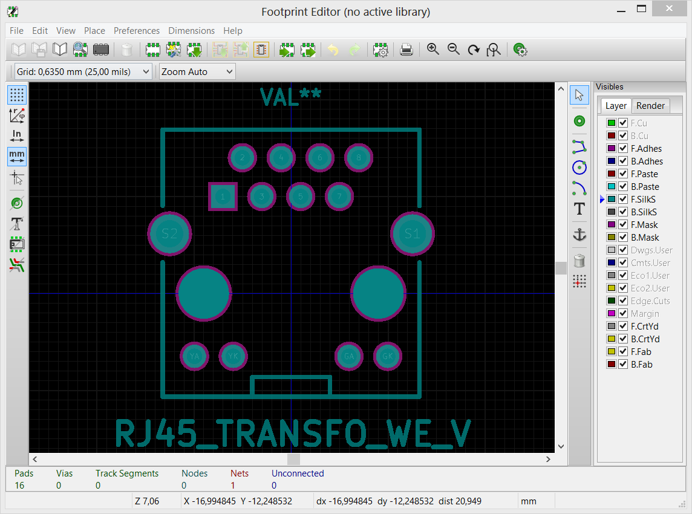

.kicad StepUp tools: Load Footprint
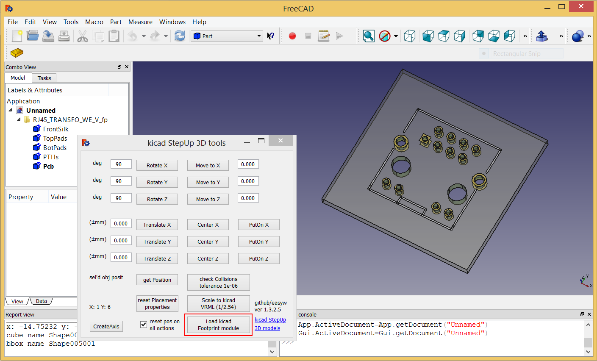

.kicad StepUp tools: Align 3D model to footprint
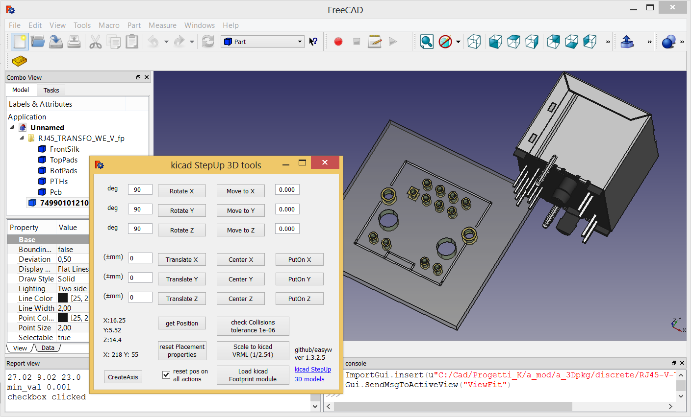

.kicad StepUp tools: 3D STEP model aligned
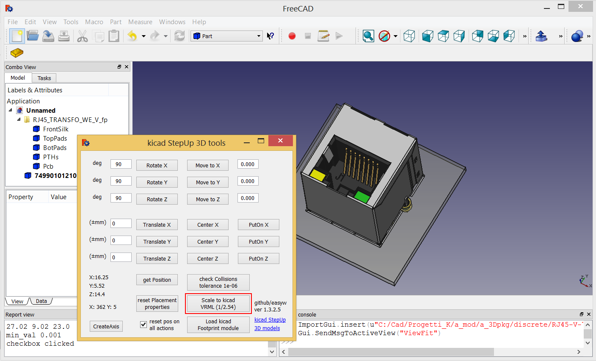

.kicad StepUp tools: 3D VRML model aligned
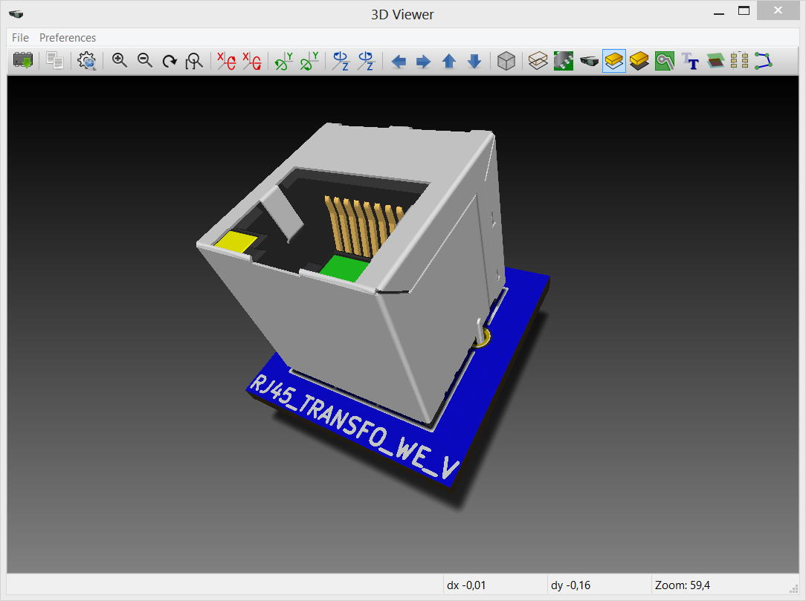

<<<

.kicad StepUp tools: align 3D STEP and VRML to footprint      - video tutorial
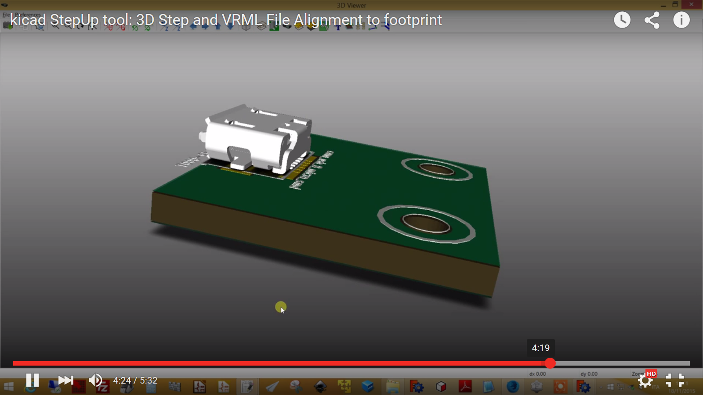
link:https://youtu.be/O6vr8QFnYGw[YouTube Kicad StepUp tool: Align 3D Step model to pcbnew footprint video]

<<<

Generating smaller 3D model with bounding boxes
------------------------------------------------

Sometimes the need would be just a 3D MCAD model for analysis or simple space constraints,
so a nice detailed component models in MCAD system may be not required or desired; +
in that case it is possible to configure the exporter to: +

- skip 3D models by name +
- skip models with a volume less than an assigned value +
- skip models with a height less than an assigned value +
- convert the remaining parts, or all but edge connectors, to bounding boxes +

The result 3D MCAD model will have the accuracy of the pcb and assemblies only when needed,
maintaining the model light as required. +

The config file  _ksu-config.cfg_ let you configure the following parameters:

1. 3D path prefix +
   your KISYS3DMOD path (see kicad for help) or 3D model path prefix +
   ${KIPRJMOD} var is supported
2. blacklist of 3D models +
   none=all 3D models will be parsed; +
   volume=1 means all models with a volume < 1mm3 will not be included +
   height=1 means all models with a height < 1mm  will not be included
3. pcb color r,g,b +
   e.g. 0.0,0.5,0.0,light green
4. bounding box option +
   LIST list of modules, separated by a comma, not converted to bbox +
   ALL or off
5. placement options of board and parts +
   useAuxOrigin, useBaseOrigin, useBasePoint;x;y, usedefault, +AutoAdjust
6. virtual modules to be or not added to board +
   if a module has vitual attribute in kicad pcbnew, can be selectively parsed
7. fuse modules to board and make a single object of pcb and parts +
   fuseAll, nofuse +
   Note: be careful ... fusion can be heavy or generate FC crash with a lot of objects +
   please consider to use bbox or blacklist small objs in case of 'fuseAll' option

Skipping small parts and using Bounding Boxes
---------------------------------------------

.kicad StepUp: using bounding boxes for all but connectors and skipping small parts
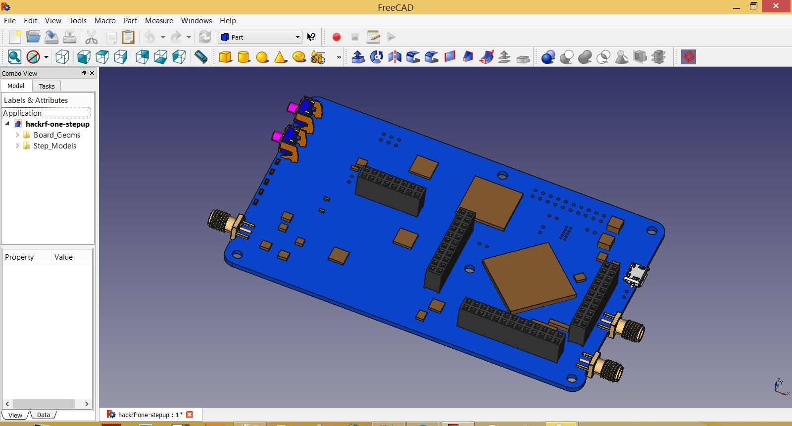

<<<

Check for Collisions and mechanical constrains
----------------------------------------------
With *'kicad-SteUp-tools Macro'* it is also possible to *detect collisions* +
and *check mechanical constrains* +
- detect collisions among part pins and drills +
- detect collisions for enclosure clearance +
  (between pcb with connectors and enclosure) +

.kicad StepUp tools: collisions check for 3D part module and footprint
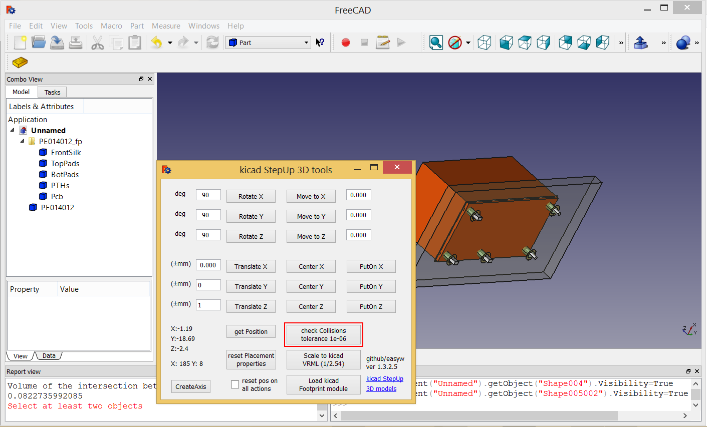

.kicad StepUp tools: collisions found for 3D part module and footprint
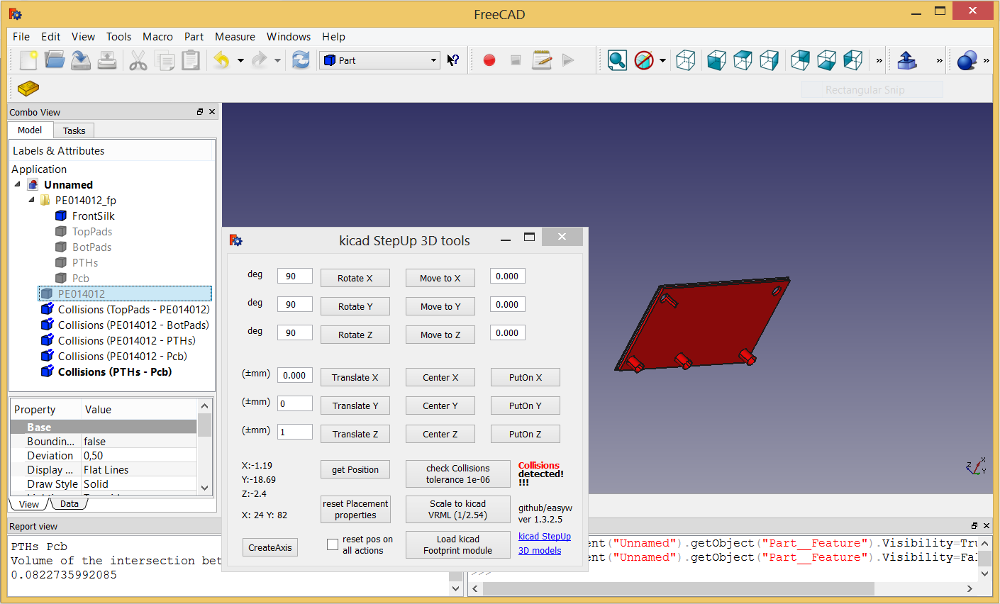

<<<

.kicad StepUp tools: collisions check for 3D pcb and connectors with Arduino-uno-enclosure
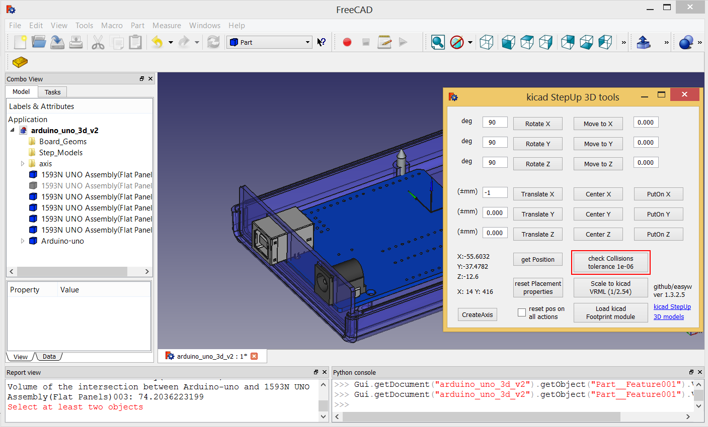

.kicad StepUp tools: collisions found for 3D pcb and connectors with Arduino-uno-enclosure
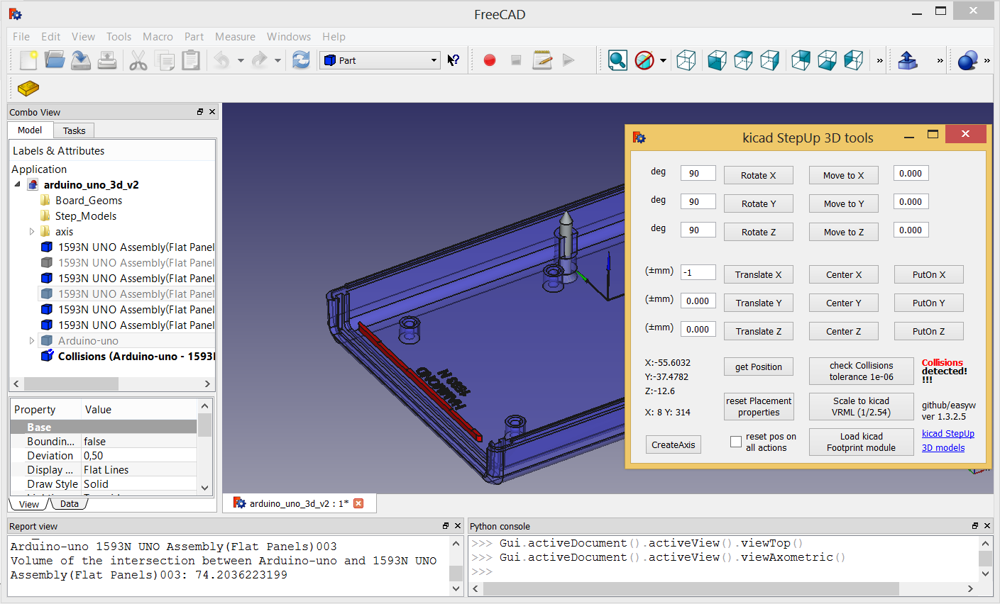

<<<

STEP AP214 and VRML FreeCAD scripted repository ready to kicad StepUp
---------------------------------------------------------------------
link:https://github.com/easyw/kicad-3d-models-in-freecad[repository of 3D STEP models:] +
me and HyOzd have done a repository of many electronic components *STEP AP214* and *VRML* models,
with some nice scripts to build parametric models for +
'SOIC, SSOP, TSSOP, SOT, QFP, QFN' ICs, 'DIP' ICs, 'Chip Resistors, Chip Capacitors, Pin Headers' +
just compiling a parametric text file with dimensions from component data sheet +
link:https://github.com/easyw/kicad-3d-models-in-freecad/tree/master/cadquery/FCAD_script_generator[3D-script-generator and 3D models] +
'more is coming ...'

.kicad StepUp: parametric STEP & VRML library
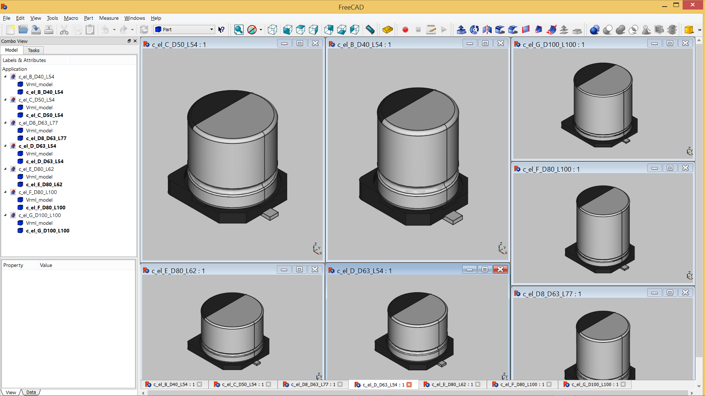
.kicad StepUp: parametric STEP & VRML library
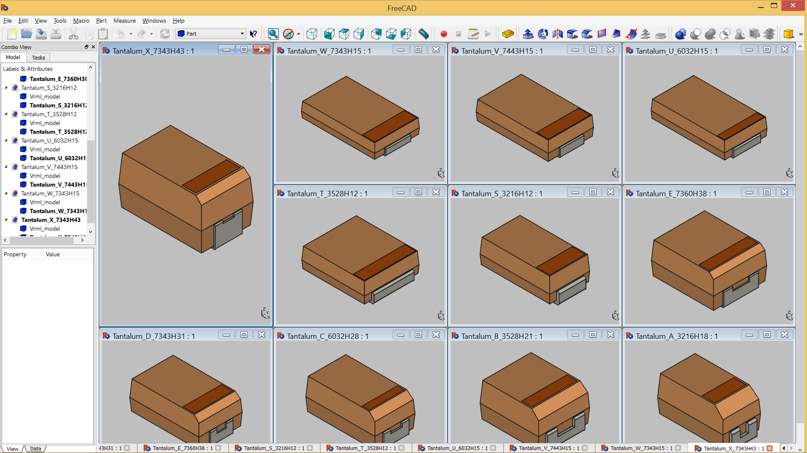
.kicad StepUp: parametric STEP & VRML library
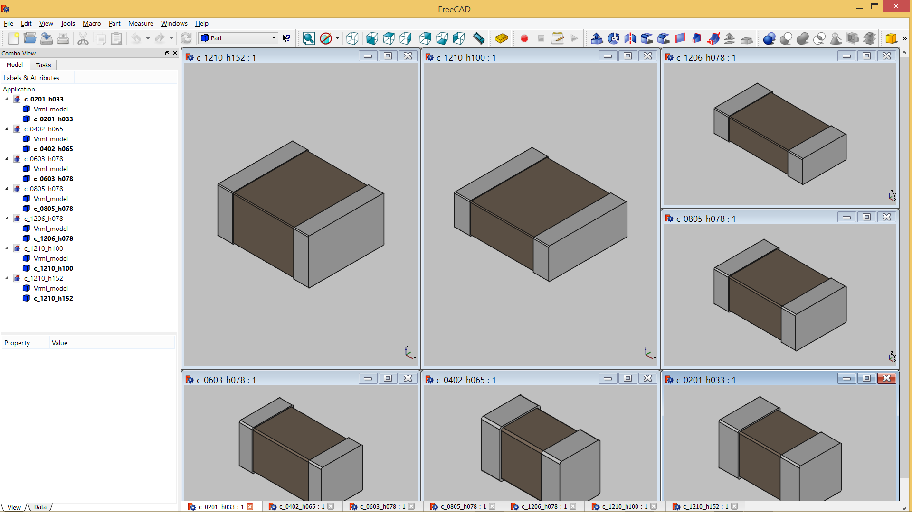
.kicad StepUp: parametric STEP & VRML library
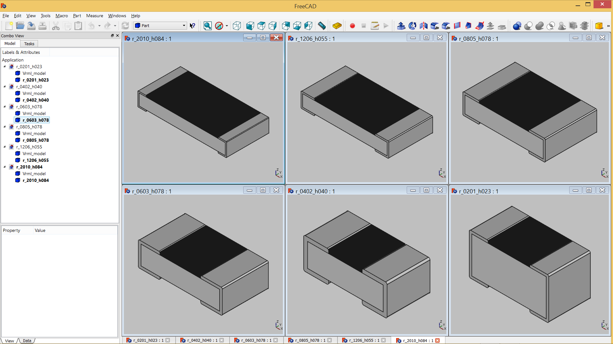
.kicad StepUp: parametric STEP & VRML library
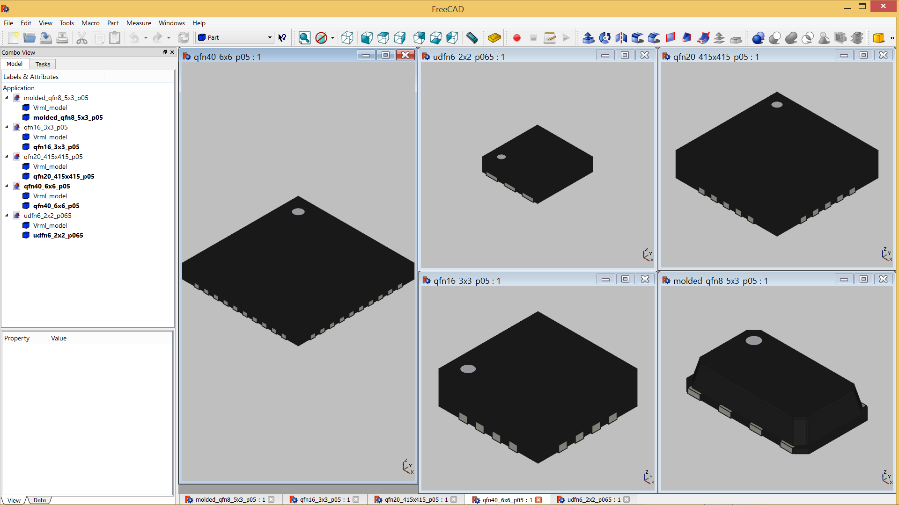
.kicad StepUp: parametric STEP & VRML library
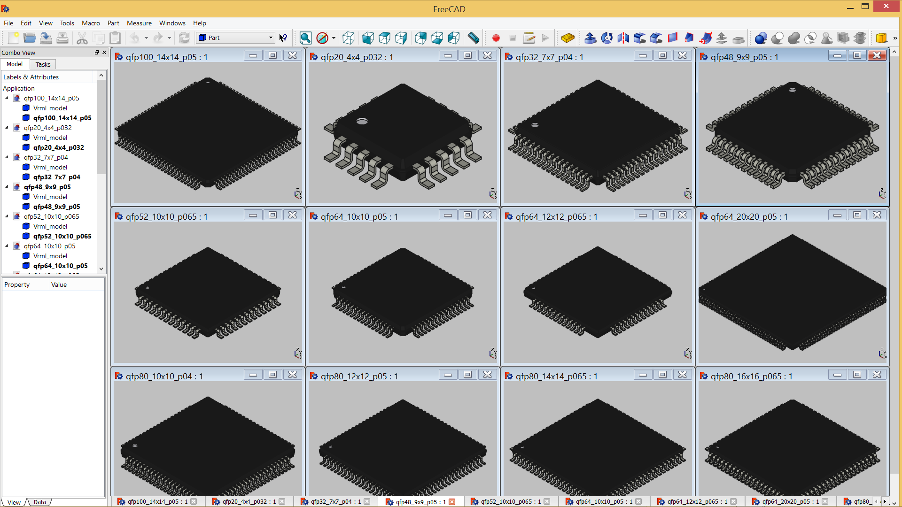
.kicad StepUp: parametric STEP & VRML library
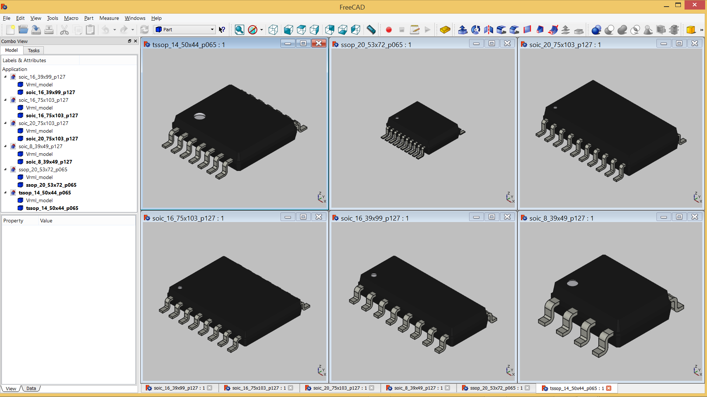
.kicad StepUp: parametric STEP & VRML library
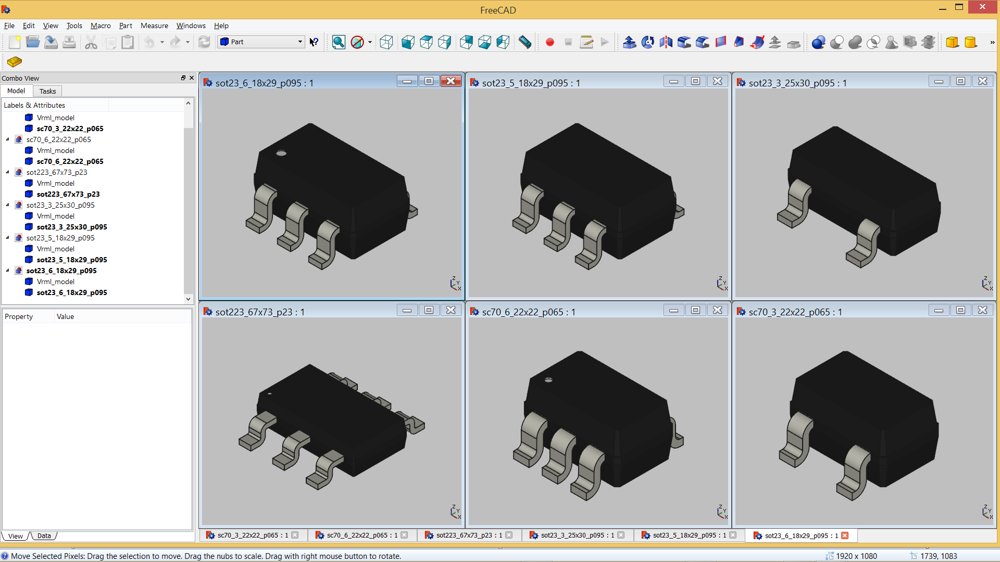

<<<
OLD Blender patch for loading FreeCAD generated VRML files
----------------------------------------------------------

link:https://youtu.be/oq-w532Qmlo[kicad StepUp rendered with Blender]

.kicad StepUp: video rendered with Blender
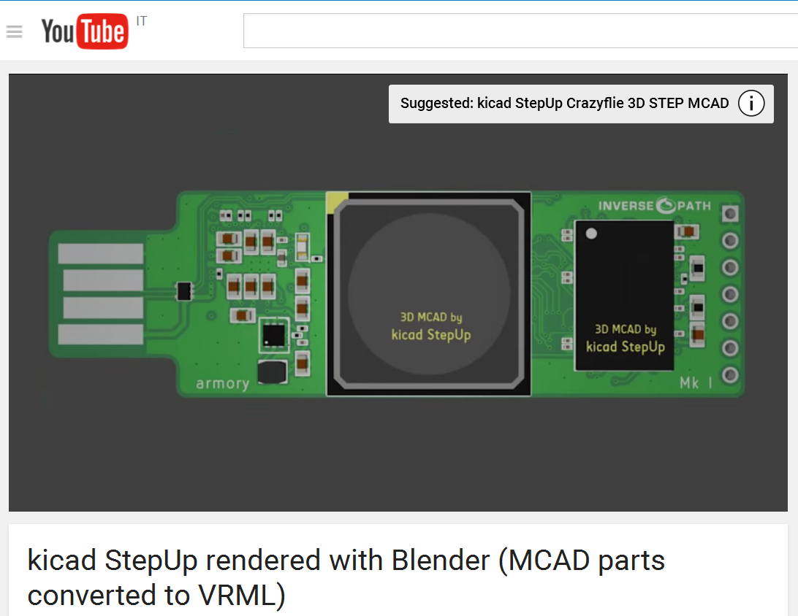

Recently I've worked with hyOzd to include in kicad-SteUp-tools.FCMacro an exporting function to create
VRML smaller in file size and **fully compatible with Kicad and Blender** +
**so there is no need to load the workaround :)** +

'Here the old workaround for completeness'
Note: Blender has a limited VRML import support +
link:http://forum.freecadweb.org/viewtopic.php?t=10815[freecad forum: blender vrml import limits discussion] +
so FreeCAD VRML exported models are not rendered well in standard Blender import routines... +
hyOzd has developed a python patch plugin that fills the gap... +
link:http://forum.freecadweb.org/viewtopic.php?t=10815#p103529[freecad forum: blender VRML patch plugin] +
Then you will get a clean scene in blender with VRML files exported from FreeCAD +

<<< 

**NB the new config file is in home user dir** +
Linux and OSX: +
   '~/' which is '$HOME' +
Windows: +
   '%HOMEPATH%' +
kicad-StepUp-tools.FCMacro has a Config Button to display the **ksu-config.ini** file +
and a button for a small Help +

OLD config file: ksu-config.cfg
-------------------------------
the conversion between kicad pcb and MCAD can be configureb with the parameters included in
the ksu-config.cfg file; the parameters are as followings: +
`## each line starting with a # is a comment` +
`## put here your KISYS3DMOD path or 3D model path` +
`./` +
`## put here your model names that you don't want to load` +
`## separated by a comma (none means all the models will be parsed)` +
`## (volume=1 all models with a vol<1mm3 will not be included)` +
`## (height=1 all models with a height < 1mm  wont be included)` +
`#r_0603,r_0402,c_0402,c_0603` +
`none` +
`## pcb color r,g,b e.g. 0.0,0.5,0.0,light green` +
`0.0,0.298,1.0,lightblue (0,76,255)` +
`## bounding box option LIST=>whitelist (not converted to bbox)` +
`#bbox LIST dpak-to252,sod80` +
`#bbox ALL` +
`bbox off default` +
`## placement options` +
`## useAuxOrigin, useBaseOrigin, useBasePoint;x;y, usedefault,` +
`## +AutoAdjust` +
`#placement: useAuxOrigin` +
`#placement: useAuxOrigin +AutoAdjust` +
`#placement: useBasePoint;37.0;50.0;` +
`#placement: useBasePoint;37.0;50.0; +AutoAdjust` +
`#placement: useBaseOrigin #place board @ 0,0,0` +
`#placement: useBaseOrigin +AutoAdjust #place board @ 0,0,0` +
`#placement: usedefault` +
`#placement: usedefault +AutoAdjust` +
`placement: useBaseOrigin #place board @ 0,0,0` +
`## virtual modules to be or not added to board` +
`#addVirtual` +
`noVirtual` +
`## fuse modules to board, please use bbox or blacklist small objs` +
`## fusion can be heavy or generate FC crash with a lot of objects` +
`#fuseAll` +
`nofuse  #default` +

<<<

List of files
-------------

kicad_StepUp-Tools.FCMacro = Load kicad Board, Load Footprint, Move, Rotate, Scale, export wrl, check Collisions;
GUI Macro to easily manage ALL MCAD conversion for board and manufacturers STEP modules and kicad VRML +
kicadStepUp-starter-Guide.pdf = 'kicad StepUp' starter Guide
kicad_StepUp.FCMacro = OLD 'kicad StepUp' 3D MCAD exporter script/plugin +
ksu-config.cfg = OLD configuration file +
kicad_StepUp_vrml_export.FCMacro = OLD STEP to scaled VRML script +

credits
-------

'kicad StepUp' script author is {author} link:https://launchpad.net/~easyw/[easyw@launchpad] +
Guide Doc Version is {revision}

link:http://kicad-pcb.org/[kicad EDA] +
- IDF export for kicad (Cirilo Bernardo)

link:http://freecadweb.org/[FreeCAD]

IDF import for FreeCAD +
- Milos Koutny (milos.koutny@gmail.com)

link:https://github.com/jmwright/cadquery-freecad-module/archive/master.zip/[CadQuery module] +
- CadQuery FreeCAD module +

link:https://bitbucket.org/hyOzd/freecad-macros[hyOzd freecad macros] +
- hyOzd parametric script

FreeCAD-PCB +
- marmni <marmni@onet.eu>

<<<

[[copyright]]
*Copyright*
-----------

This document '{docname}' and kicad StepUp scripts are Copyright © 2015 by {Author}.
Kicad STEPUP (TM) is a TradeMark and cannot be freely useable. +
This program is free software; you can redistribute it and/or modify it
under the terms of the GNU Affero General Public License as published by
the Free Software Foundation to ensure cooperation with the community
in the case of network server software; for detail see the LICENCE text file. +
http://www.gnu.org/licenses/agpl-3.0.en.html +
Moreover you have to include the original author copyright. +

All trademarks within this guide belong to their legitimate owners.

Risk disclaimer
---------------

*USE 3D CAD DATA AT YOUR OWN RISK +
DO NOT RELY UPON ANY INFORMATION FOUND HERE WITHOUT INDEPENDENT VERIFICATION.*
